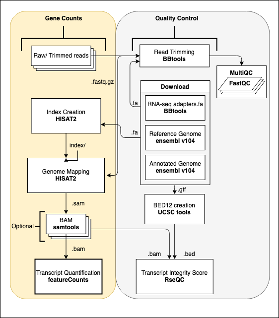
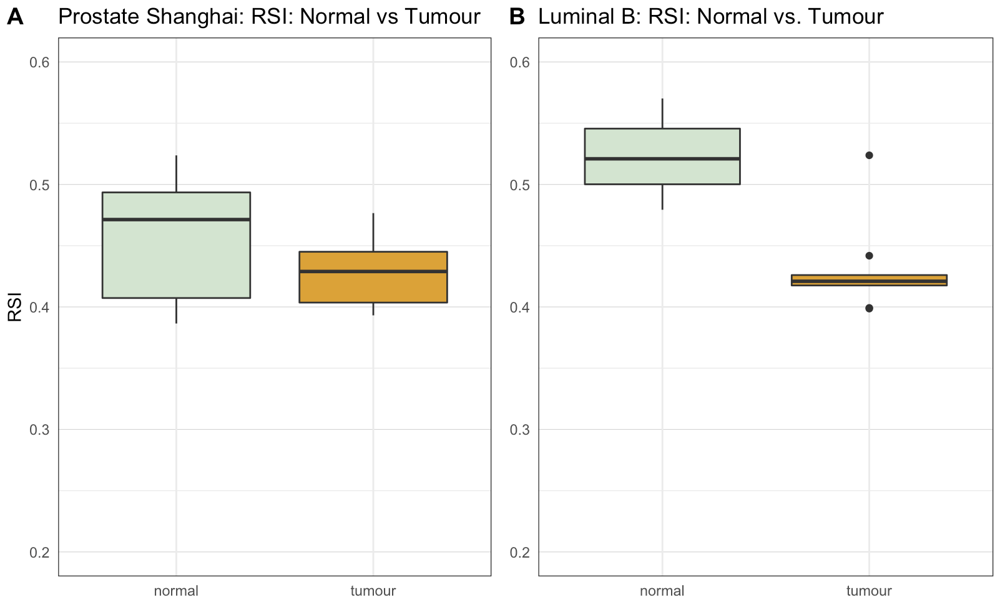

# Radiosensitivity Index (RSI) Analysis
## Objective

This repository comprises of a methodology to pre-process RNA-seq data in order to obtain gene
level counts for the calculation of RSI. All UNIX-based sample processing was performed using Nextflow
for parallelization and reproducibility. Docker and Singularity were used in combination
for containerization. Details regarding usage can be found below under *usage*. Gene count data manipulation, RSI and GARD
(Genomically Adjusted Radiation Dose) calculation and data visualisation are performed and detailed
in Rmd, with examples of RSI output below. 

## Data Preprocessing
### Nextflow Script


## Singularity

For use with Nextflow, singularity container can be built using Docker and the below command.

```
singularity pull --name rnaseq.simg docker://bennolan/rnaseq:latest
```

### Tools in Docker container

[https://hub.docker.com/repository/docker/bennolan/rnaseq]

* **FastQC:** 0.11.9
* **MultiQC:** 1.10.1
* **RseQC:** 4.0.0
* **bbmap:** 38.90
* **hisat2:** 2.1.0
* **subread**: 2.0.1
* **ucsc-genepredtobed:** 377
* **ucsc-gtftogenepred:** 377

## Usage

Below is the basic usage of the nextflow script, many optional commands can be used

```
nextflow run main.nf --input 'fastq_reads/*_{1,2}.fastq.gz' --outdir <output_directory> --cpus 4 -with-singularity <path_to_singularity_container>
```

### Required commands

```
[--input]: Input paired-end reads within single-quotes.
[--outdir]: Output directory. 
[--cpus]: Number of CPUs user wishes to use for genome alignment with hisat2 and featureCounts.
```

### Optional

```
[-with-singularity]: Path to singularity container.
[--trim_fastq]: Flag to perform read trimming. Default: True
[--run_qc_trim]: Flag to run FastQC and MultiQC on trimmed reads. Default: True
[--bams]: Path to BAM files. Only performs featureCounts and RseQC if present.
[--fasta]: Path to reference DNA file. Automatically downloaded if left empty
[--adapters]: Path to adapters.fa file from BBtools (bbmap). Automatically downloaded if left empty
[--index]: Path to hisat2 index directory followed by basename for index e.g. './index/indexbase'

[--help]: Displays above message on the command line.
```

## R analysis

### RSI/ GARD analysis
RSI and GARD calculation can be performed using the `calc_RSI_GARD` function in `rsi_breast_prostate.Rmd` 
which was used for the analysis of a breast cancer and prostate cancer dataset with subsequent data visualisation. Examples shown below for
data processing, RSI calculation and data visualisation for both datasets.


